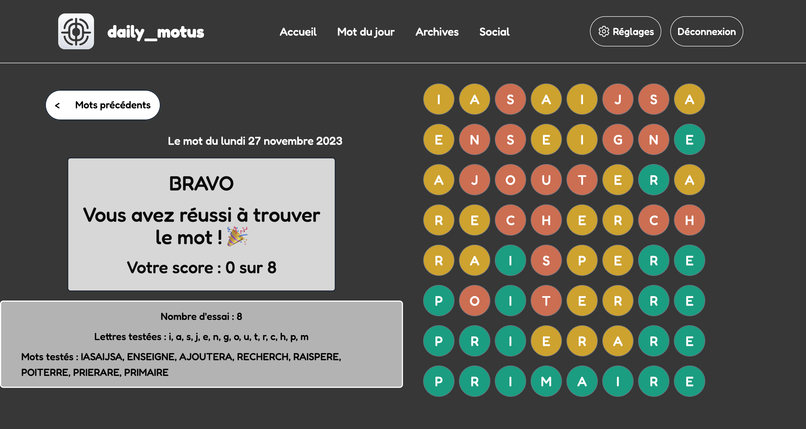
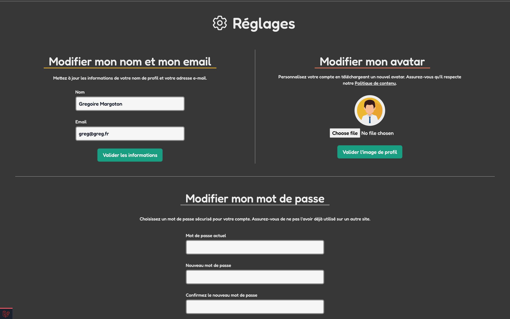
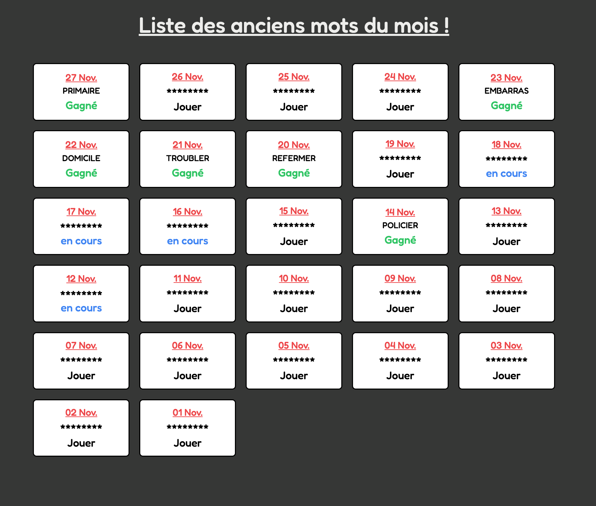

# Projet Motus en Laravel

## Description

Il s'agit d'un projet de jeu de motus en Laravel. 
Le site est composé d'une authentification obligatoire permettant de jouer au mot du jour ou de jouer au mot des jours précédents.
Le principe du jeu est de trouver un mot de 8 lettres en 8 essais, chaque jour.

On peut également consulter ses scores et les scores des autres joueurs.

Chaque jour, le site propose un nouveau mot à trouver, généré aléatoirement à partir d'une API : https://trouve-mot.fr/

Le site est composé de 3 pages principales :
- La page "Mot du jour" permettant de jouer au mot du jour
- La page "Archives" permettant de jouer au mot des jours précédents
- La page "Social" permettant d'ajouter des amis et de consulter les scores des autres joueurs

## Installation

### Suivre les instructions d'installation 
[en allant ou cliquant sur le lien : https://github.com/dhippo/Motus-Laravel-Project/blob/master/installation/README.md](https://github.com/dhippo/Motus-Laravel-Project/blob/master/installation/README.md "installation")

## Screenshots

